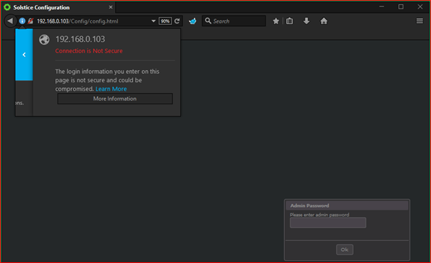
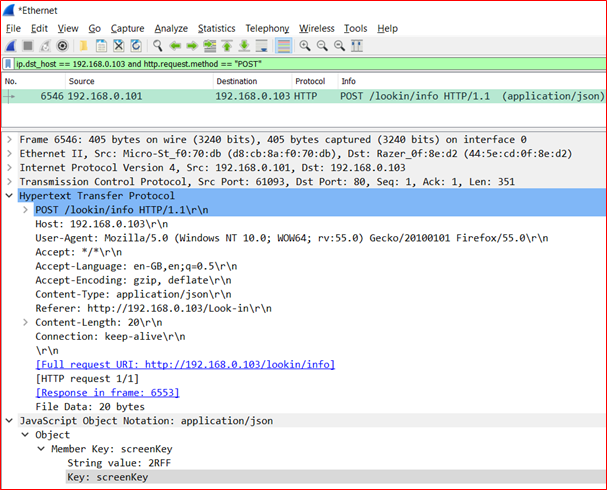

# solstice-pod-cves

## Multiple CVEs for Solstice Pod from Mersive Technologies Inc.

Alexandre Teyar has identified the following high-severity vulnerabilities in Mersive Solstice Pods – a wireless collaboration and presentation platform designed by [Mersive Technologies Inc.](https://www.mersive.com/uk/):

| CVE                                                                             | Description                                                                                                                                                       | CVSS Base Score | CVSS Vector                                  |
| ------------------------------------------------------------------------------- | ----------------------------------------------------------------------------------------------------------------------------------------------------------------- | --------------- | -------------------------------------------- |
| [CVE-2017-12945](https://cve.mitre.org/cgi-bin/cvename.cgi?name=CVE-2017-12945) | [(Remote) (authenticated) (blind) OS command injection vulnerability](https://github.com/aress31/cve-2017-12945)                                                  | 8.8             | CVSS:3.1/AV:N/AC:L/PR:L/UI:N/S:U/C:H/I:H/A:H |
| [CVE-2020-35584](https://cve.mitre.org/cgi-bin/cvename.cgi?name=CVE-2020-35584) | [Unencrypted communications posing risks of "Man-in-the-Middle" (MitM) attacks](<#Unencrypted-communications-posing-risks-of-"Man-in-the-Middle"-(MitM)-attacks>) | N/A             | N/A                                          |
| [CVE-2020-35585](https://cve.mitre.org/cgi-bin/cvename.cgi?name=CVE-2020-35585) | [Insufficient anti-enumeration mechanisms for Screen Key](#Insufficient-anti-enumeration-mechanisms-for-Screen-Key)                                               | N/A             | N/A                                          |
| [CVE-2020-35586](https://cve.mitre.org/cgi-bin/cvename.cgi?name=CVE-2020-35586) | [Insufficient anti-enumeration mechanisms for Administrator Password](#Insufficient-anti-enumeration-mechanisms-for-Administrator-Password)                       | N/A             | N/A                                          |
| [CVE-2020-35587](https://cve.mitre.org/cgi-bin/cvename.cgi?name=CVE-2020-35584) | [Lack of binary code obfuscation](#Lack-of-binary-code-obfuscation)                                                                                               | N/A             | N/A                                          |

These vulnerabilities have been validated on a device running the version 3.0.3 of the firmware.

_Note: Some of these vulnerabilities are explotiable on later version of the firmware, see details for each vulnerabilities._

## Insufficient anti-enumeration mechanisms for Administrator Password

### Affected versions

All version of Mersive Solstice Pods running a firmware version prior to **3.3.0 // May 2018 || 4.3 (15966) // November 2019** as acknowledged on the [vendor website](https://documentation.mersive.com/content/pages/release-notes.htm).

```
3.3.0 // May 2018
--- SNIP ---
Fixes and Enhancements
Security enhancements have been made to improve the install process and prevent brute force attacks.
--- SNIP ---
```

```
Open4.3 (15966) // November 2019
-- SNIP ---
Fixes and Enhancements
Security enhancement to prevent certain types of brute force attacks.
--- SNIP ---
```

### Attack vectors

The Administrator password can be enumerated using brute-force attacks via the Solstice Open Control API, see the request/response below.

Anti-automation techniques can prevent an attacker from automating a process that was originally designed to be performed only in a manual fashion, i.e. by a human web user.

An Administrator password is not subject to any complexity constraint, making it potentially vulnerable to dictionary and raw brute force attacks.

```http
GET /Config/service/initModel?password=<administrator_password>&_=1481538025746 HTTP/1.1
Host: REDACTED:8443
--- SNIP ---
Connection: keep-alive
```

For incorrect attempts, the Solstice Pod always returns:

```json
{ "passwordRequired": true }
```

Which enables an attacker to automate the guessing process.

### References

Mitre CVE Reference:

- https://cve.mitre.org/cgi-bin/cvename.cgi?name=2020-35586

Vendor Change Log:

- https://documentation.mersive.com/content/pages/release-notes.htm

## Insufficient anti-enumeration mechanisms for Screen Key

### Affected versions

All version of Mersive Solstice Pods running a firmware version prior to **3.3.0 // May 2018 || 4.3 (15966) // November 2019** as acknowledged on the [vendor website](https://documentation.mersive.com/content/pages/release-notes.htm).

```
3.3.0 // May 2018
--- SNIP ---
Fixes and Enhancements
Security enhancements have been made to improve the install process and prevent brute force attacks.
--- SNIP ---
```

```
Open4.3 (15966) // November 2019
-- SNIP ---
Fixes and Enhancements
Security enhancement to prevent certain types of brute force attacks.
--- SNIP ---
```

### Attack vectors

A screen key can be enumerated using brute-force attacks via the Solstice Open Control API, see the request/response below.

Anti-automation techniques can prevent an attacker from automating a process that was originally designed to be performed only in a manual fashion, i.e. by a human web user.

A screen key is `4 alpha-numerical characters`, the key space is <code>(26 + 10)<sup>4</sup></code> resulting in `1 679 616` different possible combinations; this key space is theoretically large enough to hinder trivial enumeration of screen keys.

```http
POST /lookin/info HTTP/1.1
Host: REDACTED:8443
--- SNIP ---
Connection: keep-alive

{"screenKey":"<screen_key>"}
```

For incorrect attempts, the Solstice Pod always returns:

```json
{ "screenKeyValidationRequired": "true" }
```

Which enables an attacker to automate the guessing process.

### References

Mitre CVE Reference:

- https://cve.mitre.org/cgi-bin/cvename.cgi?name=CVE-2020-35585

Vendor Change Log:

- https://documentation.mersive.com/content/pages/release-notes.htm

## Lack of binary code obfuscation

### Affected versions

All version of Mersive Solstice Pods running a firmware version prior to **3.0.3 // August 2017**.

_Note: Later versions of the firmware are likely to still be vulnerable to this issue. If the case, please submit a PR._

### Attack vectors

The Solstice Pod firmware can be disassembled/decompiled into `Smali/Java` code using open-source tools, e.g. [apktool](https://ibotpeaches.github.io/Apktool/), [baksmali](https://github.com/JesusFreke/smali). The resulting files contain non-obfuscated code. This configuration poses inherent security risks associated with reverse-engineering and Intellectual Property (IP) theft.

An attacker could, for instance:

- Bypass the application security/commercial mechanisms checks (licenses for example) by tampering with the application code.
- Develop a competing application based upon the application code.
- Distribute a malicious version of the application through the Play Store, Internet or using social engineering attacks.

### References

Mitre CVE Reference:

- https://cve.mitre.org/cgi-bin/cvename.cgi?name=2017-12945

Vendor Change Log:

- https://documentation.mersive.com/content/pages/release-notes.htm

## Unencrypted communications posing risks of "Man-in-the-Middle" (MitM) attacks

### Affected versions

All version of Mersive Solstice Pods running a firmware version prior to **3.0.3 // August 2017**.

_Note: Later versions of the firmware are likely to still be vulnerable to this issue. If the case, please submit a PR._

### Attack vectors

The web application allowing Solstice pods’ users to configure them and to use the `Browser Look-in` feature uses an unencrypted protocol, namely `HTTP` as shown in the following screenshot.

<figure>
    
    <figcaption>Login portal using HTTP.</figcaption>
</figure>

An attacker suitably positioned to view a legitimate user's network traffic could record and monitor their interactions with the web application to obtain any information the user supplies, this could include **administrator passwords** and **screen keys**, as shown in the screenshots below.

- Packets capture showing the administrator password being intercepted – the administrator password is transmitted hashed using the `SHA1` algorithm from firmware version 3.0.3:

<figure>
    
    <figcaption>Packets capture showing the administrator password being intercepted – the administrator password is transmitted hashed using the SHA1 algorithm.</figcaption>
</figure>

- Packets capture showing the screen key being intercepted:

<figure>
    
    <figcaption>Packets capture showing the screen key being intercepted.</figcaption>
</figure>

### References

Mitre CVE Reference:

- https://cve.mitre.org/cgi-bin/cvename.cgi?name=2020-35584

Vendor Change Log:

- https://documentation.mersive.com/content/pages/release-notes.htm
